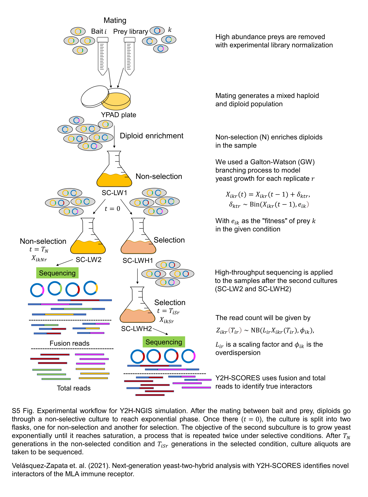

# Simulation

To test the performance of Y2H-SCORES under different conditions we developed a framework for Y2H-NGIS simulation, using empirical data to motivate simulation models and parameter values. Figure S5 shows the experimental workflow we wish to simulate. We simulated both total and fusion read counts under selected and non-selected conditions. This [pdf file](https://github.com/vvelasqz/Y2H-SCORES/blob/master/Publication/Y2H-NGIS_simulator/Y2H-NGIS%20simulation%20model%20equations.pdf) contains all the details about he simulaiton model

