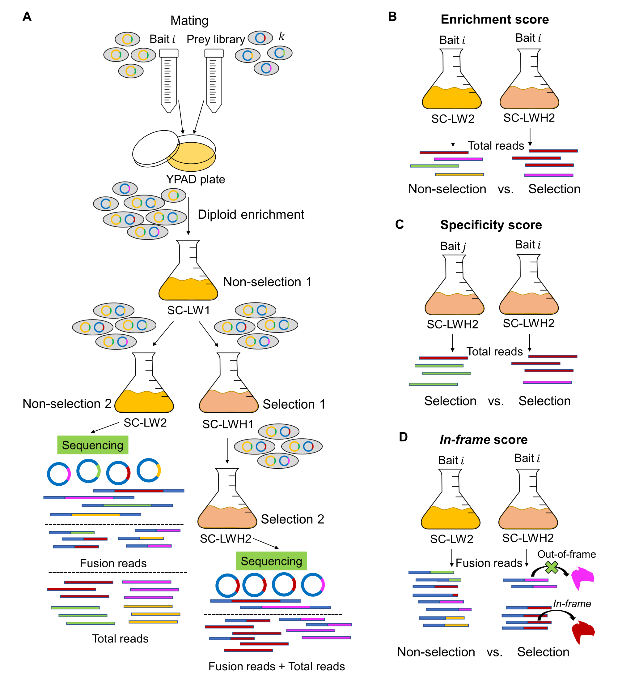


# Software and supporting code for Y2H-SCORES

This repository contains the software Y2H-SCORES and supporting code for the publication Velásquez-Zapata *et.al.* (2021) Next-generation yeast-two-hybrid analysis with Y2H-SCORES identifies novel interactors of the MLA immune receptor.   

Y2H-SCORES is a software developed to rank protein-protein interactions from yeast two-hybrid next generaiton interaction screening (Y2H-NGIS) data. As a graphical summary of how the software works we present the Y2H-NGIS workflow and Y2H-SCORES. A) Experimental workflow for batch Y2H-NGIS. After the mating between bait and prey yeast cells, diploids go through a non-selective culture to reach exponential phase. Once there, the culture is split into two flasks, one for non-selection and another for selection. After reaching saturation in each condition, culture aliquots are taken to be sequenced. Schematic representation of the Y2H-SCORES, which consists of three ranking scores: B) enrichment score, which detects changes in prey proportions in selected and non-selected conditions. C) The specificity score measures differences in the prey enrichments with different baits under selection. D) The *in-frame* score identifies the enrichment of prey reading frames under selection, assigning higher values to *in-frame* preys.

**Overview**

The structure of this repository consists of two directories. In the [Software](https://github.com/vvelasqz/Y2H-SCORES/tree/master/Software) directory all the functions and instructions to operate Y2H-SCORES can be found. The [Publication](https://github.com/vvelasqz/Y2H-SCORES/tree/master/Publication) directory contains all the supporting code for the publication, including the [Y2H-NGIS simulator](https://github.com/vvelasqz/Y2H-SCORES/tree/master/Publication/Y2H-NGIS_simulator) and the [Benchmarking](https://github.com/vvelasqz/Y2H-SCORES/tree/master/Publication/Benchmarking) of the method with several datasets.

Y2H-SCORES has been published in PLoS Computational Biology, it can be accessed from https://doi.org/10.1371/journal.pcbi.1008890. Please refer to the paper for more details about each module. The entire pipeline has been coded in R.
 
**Citations**

If you use Y2H-SCORES, please cite  

* Valeria Velásquez-Zapata, J Mitch Elmore, Sagnik Banerjee, Karin S Dorman, Roger P Wise (2021) Next-generation yeast-two-hybrid analysis with Y2H-SCORES identifies novel interactors of the MLA immune receptor. PLoS Comput Biol 17(4): e1008890. https://doi.org/10.1371/journal.pcbi.1008890

* Sagnik Banerjee, Valeria Velásquez-Zapata, Gregory Fuerst, J Mitch Elmore, Roger P Wise (2020) NGPINT: a next-generation protein–protein interaction software. Briefings in Bioinformatics: bbaa351, https://doi.org/10.1093/bib/bbaa351

